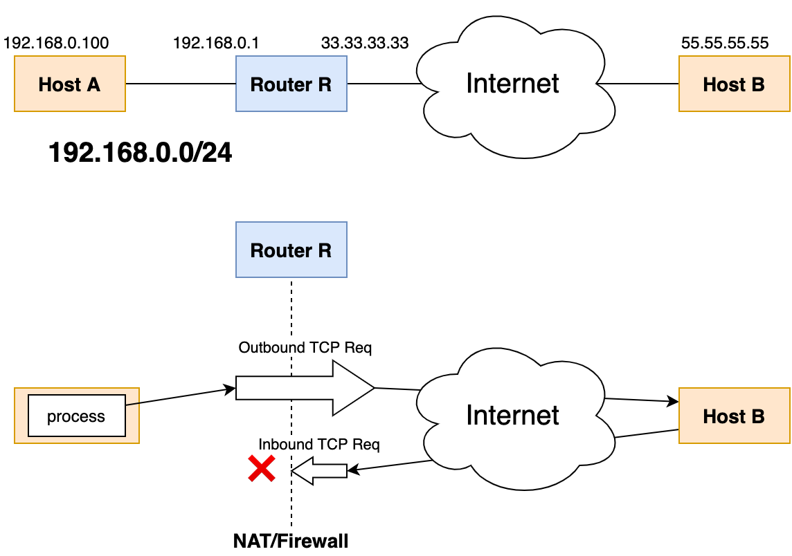
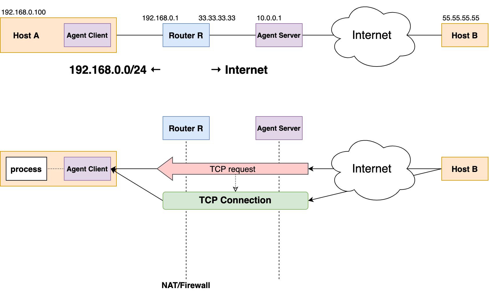

# TCP Piercer
> TCP Piercer는 TCP 동작 방식을 이용하여 구현할 수 있는 기능에 대한 개념 증명 프로젝트이며
> TCP를 공부하고 적용하는 데에 주 목적이 있습니다.

(프로그램 구현으로서) TCP Piercer는 NAT/Firewall을 우회하여 TCP 연결 수립을 수행합니다.

일반적으로 라우터의 NAT/Firewall은 outbound TCP request는 허용하고 inbound TCP request가 차단하도록 설정됩니다.
 

TCP Piercer는 라우터 설정에 접근할 필요 없이 내부 네트워크의 호스트가 inbound TCP request를 수신하는 것이 가능하게 하며,
이 때 수립된 TCP 연결은 [터널링][Wikipedia, Tunneling protocol] 없이 동작하기 때문에 오버헤드가 없습니다.
 

## 설계
- 라우터의 NAT translation behavior는 [endpoint-independent][rfc4787, section 4.1]라고 가정합니다.
- Agent Server는 라우터와 인터넷 사이의 _모든 패킷 흐름을 통제할 수_ 있다고 가정합니다.

자세한 동작 원리는 [이 곳](./docs/network-flow.md)에 나와있습니다.

## 한계
- Agent Server는 라우터와 인터넷 사이의 _모든 패킷 흐름을 통제할 수_ 있어야 합니다. 따라서 모든 상황에서
터널링 프로토콜을 대체할 수 있는 것은 아닙니다.

## 계획
### 시뮬레이션
TCP Piercer는 실제 네트워크 장비에서 동작하는 것이 이상적이나 본 프로젝트가 개념 증명에 초점을 맞췄기 때문에
빠르고 효율적인 실증을 위해 여러 개의 도커 컨테이너로 시뮬레이션할 수 있는 도구도 포함할 것입니다.

[rfc4787, section 4.1]: https://tools.ietf.org/html/rfc4787#section-4.1
[Wikipedia, TUN/TAP]: https://en.wikipedia.org/wiki/TUN/TAP
[Wikipedia, Tunneling protocol]: https://en.wikipedia.org/wiki/Tunneling_protocol
