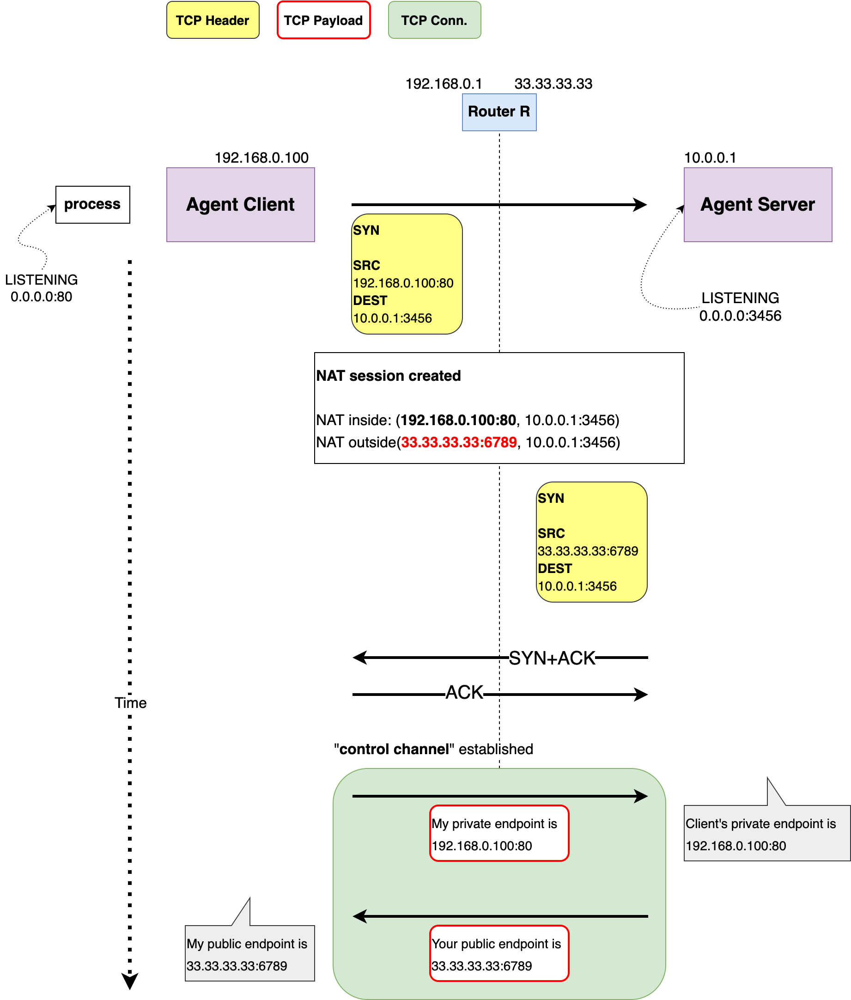
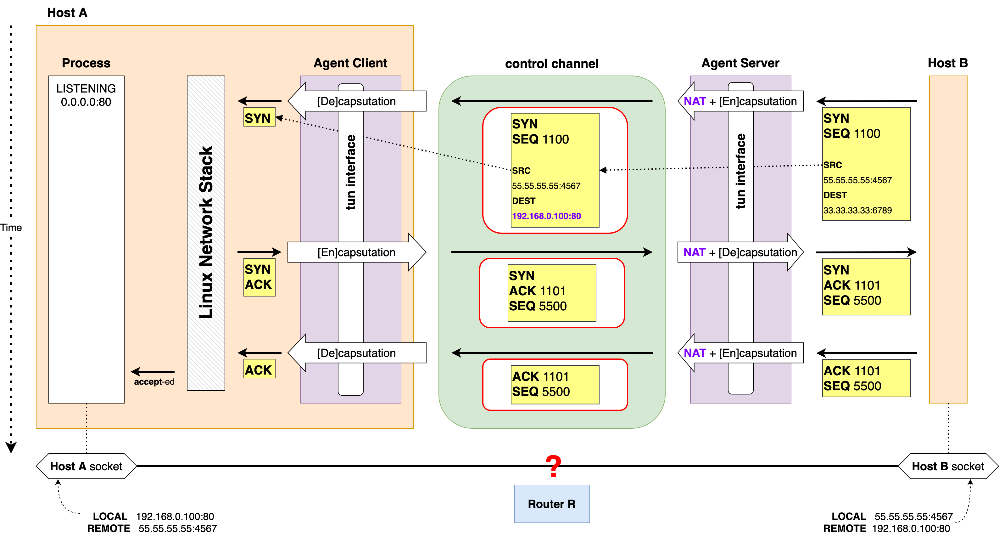
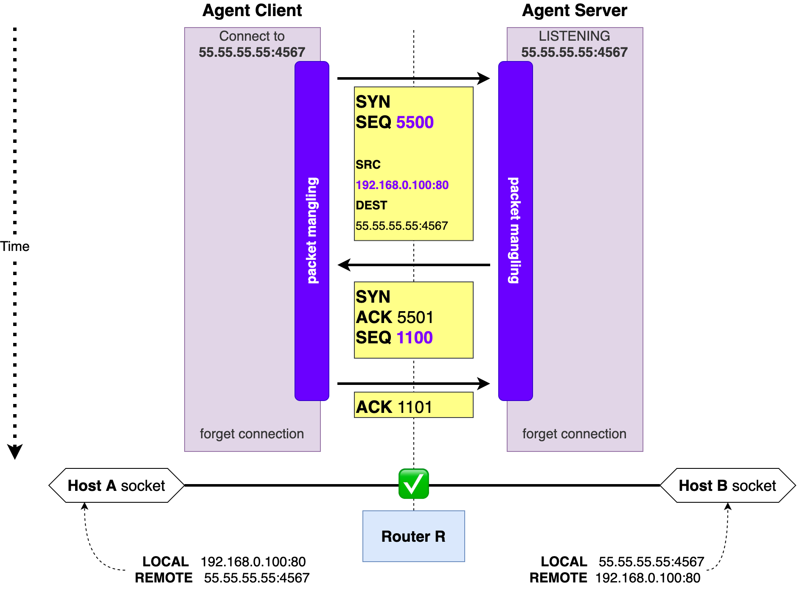

# 네트워크 내부 흐름
## 문제 상황

- Router R에서 동작하는 NAT/Firewall로 인해 Host A에서 외부 인터넷으로 (outbound) TCP request를 보낼 수 있지만
그 반대 방향의 TCP Request는 차단됩니다.
- 일반적인 라우터 설정입니다.

## 목표 상태

- Agent Client와 Agent Server로 구성된 TCP Piercer는 외부 인터넷의 Host B가 보낸 inbound TCP request를 중개하여
Host A의 프로세스와 Host B의 프로세스 간의 TCP connection을 수립시킵니다.
- inbound TCP request로 수립된 TCP connection은 tunneling procotol을 수반하지 않습니다.

## 제어 채널 생성 및 초기화

- Host B가 Host A에게 TCP request를 보내려면 Host A의 private endpoint에 대응되는 Router R의 public endpoint가 존재해야 합니다.
- Agent Client와 Agent Server 간에 TCP connection이 수립되면 Router R에 NAT session이 생성되고
private endpoint와 public endpoint 간에 매핑 또한 생성됩니다.
  - 위의 예시의 경우 private endpoint는 `192.168.0.100:80` 이고 public endpoint는 `33.33.33.33:6789`
- NAT이 endpoint-independent이기 때문에 destination endpoint가 달라져도 private endpoint가 같으면 public endpoint도 같습니다.
  - 나중에 Host A에서 Host B로 TCP connection이 만들어지더라도 public endpoint는 똑같이 `33.33.33.33:6789` 입니다.
- 제어 채널이 수립된 이후 Agent Client와 Agent Server 간 통신을 통해 NAT mapping을 알아냅니다.

제어 채널은 각 private endpoint 마다 생성됩니다.

## Handshake 중개

- 제어 채널이 수립된 이후부터 Agent Client/Server는 외부에서 Host A의 public endpoint로 오는 TCP request의 handshake를 중개합니다.
- SYN segment를 수신 하면 제어 채널 초기화 과정에서 얻는 NAT mapping 정보를 통해 자체적인 NAT을 수행하고
IP packet 자체를 TCP payload에 담아 (Encapsulation) 제어 채널로 보냅니다.
- Agent Client는 수신한 IP packet를 Linux Network Stack에 보냅니다.
- Linux Network Stack은 SYN segment를 수신하고 SYN+ACK segment를 송신합니다.
- SYN+ACK segment 그리고 ACK segment에 대해서도 위와 비슷한 과정이 수행 됩니다.
- 이렇게 Handshake 중개가 완료되면 Host A와 Host B는 각각의 `ESTABLISHED` 소켓을 얻습니다.
- _하지만_ 이 과정은 Router R이 전혀 개입되지 않은 상태에서 이루어졌기 때문에 NAT session이 만들어지지 않았고
따라서 두 Host의 소켓 간 통신은 비정상으로 취급됩니다.

## Handshake "끼워넣기"

- Router R에 NAT session을 만들어 주기 위해서 Agent Client와 Server 사이에 Handshake를 수행합니다.
- 정확한 NAT session 생성을 유도하기 위해서, Handshake를 수행하는 TCP segment들은 아래의 조건을 만족해야 합니다:
  1. Agent Client 측 endpoint는 반드시 Host A 소켓의 (IP, Port) 쌍과 일치해야함
  1. Agent Server 측 endpoint는 반드시 Host B 소켓의 (IP, Port) 쌍과 일치해야함
  1. 양 측 ISN 모두 Host A, B 간 Handshake 당시 생성된 ISN들과 일치해야함
- 위의 조건들은 간단한 패킷 조작으로 처리합니다. ISN들은 앞선 "Handshake 중개" 과정에서 얻어낼 수 있습니다.
- 이렇게 인위적으로 NAT session을 만들게 되면 Router R은 Host A, B 사이에서 오가는 TCP segment들을 정상 패킷으로 간주하게 됩니다.
- 이 때부터 이 TCP connection은 TCP Piercer의 통제에서 벗어납니다. 즉, 오직 양단(Host A, Host B)의 TCP/IP stack이 관리합니다.
