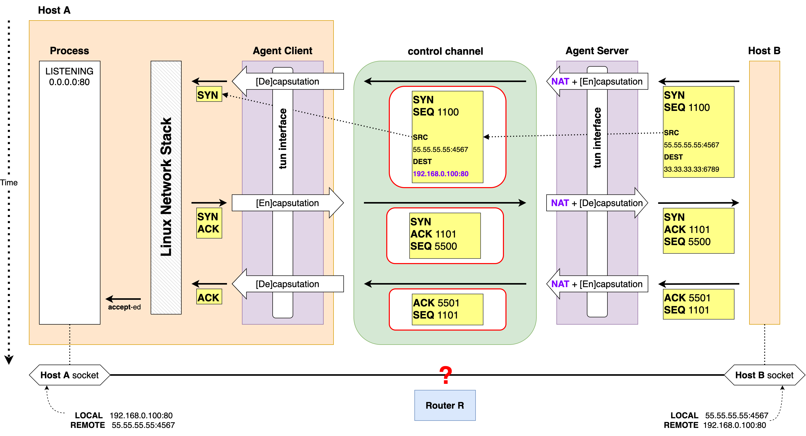

> TCP Piercer가 네트워크와 어떻게 상호작용 하여 동작을 하는지 설명합니다.

# 예시 시나리오
아래와 같은 네트워크 환경을 가정합니다.

- Host A, Host B의 IP address 및 Router R의 internal/external IP address는 그림에 나온 대로 입니다.
- Host A는 192.168.0.0/24 서브넷에 속합니다.

여기에 TCP Piercer 시스템을 추가합니다.

- Agent Client는 Host A의 프로세스입니다.
- Agent Server는 네트워크 장비 및 그 장비에서 동작하는 프로세스를 지칭합니다.
- Agent Server는 Router R과 Internet 사이의 패킷 흐름을 통제할 수 있어야 합니다. (즉, 단절점)
- Agent Server는 TCP Piercer 동작과 관련된 패킷에 대해서는 [게이트웨이][Wikipedia, Gateway] 역할을, 그 외에는 [브릿지][Wikipedia, Bridge] 역할을 수행합니다.

위와 같은 환경에서 Host B가 Host A에게 TCP request를 보내면, TCP Piercer의 Agent Client와 Agent Server가 개입하여
TCP 연결 수립을 성공시키는 과정을 설명합니다.

- 수립된 TCP 연결은 터널링 프로토콜을 수반하지 않습니다. TCP 연결 그 자체입니다.

# TCP Piercer 동작
## 제어 채널 생성 및 초기화

- Host B가 Host A에게 TCP request를 보내려면 Host A의 private endpoint에 대응되는 Router R의 public endpoint가 존재해야 합니다.
- Agent Client/Server 간에 TCP connection을 만들면 Router R의 NAT이 public endpoint로의 mapping을 추가합니다.
  - 위의 예시의 경우 private endpoint는 `192.168.0.100:80` 이고 public endpoint는 `33.33.33.33:6789`
- NAT이 endpoint-independent이기 때문에 destination endpoint가 달라져도 private endpoint가 같으면 public endpoint도 같습니다.
  - 나중에 Host A에서 Host B로 TCP connection이 만들어지더라도 public endpoint는 똑같이 `33.33.33.33:6789` 입니다.
- 제어 채널이 수립된 이후 Agent Client와 Agent Server 간 통신을 통해 NAT mapping을 알아냅니다.
- 제어 채널은 각 private endpoint 마다 생성됩니다.

## Handshake 중개

- 제어 채널이 초기화가 끝난 이후 TCP Piercer는 외부에서 Host A의 public endpoint로 오는 TCP request의 handshake를 중개합니다.
- SYN segment를 수신 하면 자체적인 NAT을 수행하고
IP packet을 TCP payload에 담아 (Encapsulation) 제어 채널로 보냅니다.
- Agent Client는 수신한 IP packet을 Linux Network Stack에 보냅니다.
- Linux Network Stack은 SYN segment를 수신하고 SYN+ACK segment를 송신합니다.
- SYN+ACK segment 그리고 ACK segment에 대해서도 위와 비슷한 과정이 수행 됩니다.
- 이렇게 Handshake 중개가 완료되면 Host A와 Host B는 TCP connection이 수립됐다고 판단하고 통신을 위한 소켓을 생성합니다.
- _하지만_ 이 과정은 Router R이 전혀 개입되지 않은 상태에서 이루어졌기 때문에 Router R에 NAT session이 만들어지지 않았고
따라서 두 호스트의 소켓 간 통신은 정상적으로 이루어지지 않습니다.

## Handshake "끼워넣기"

- Router R에 NAT session을 만들어 주기 위해서 Agent Client와 Server 사이에 Handshake를 수행합니다.
- 두 호스트 간 연결을 정확히 반영하는 NAT session 생성을 유도하기 위해서, Handshake를 수행하는 TCP segment들은 아래의 조건을 만족해야 합니다:
  1. Agent Client 측 endpoint는 반드시 Host A 소켓의 (IP, Port) 쌍과 일치해야함
  1. Agent Server 측 endpoint는 반드시 Host B 소켓의 (IP, Port) 쌍과 일치해야함
  1. 양 측 ISN(Initial Sequence Number) 모두 Host A, B 간 Handshake 당시 생성된 ISN들과 일치해야함
- 위의 조건들은 간단한 패킷 조작으로 처리합니다. ISN들은 앞선 "Handshake 중개" 과정에서 얻어낼 수 있습니다.
- NAT session이 만들어지면  Router R은 Host A, B 사이에서 오가는 TCP segment들을 정상 패킷으로 간주합니다.
- 이 때부터 이 TCP connection은 TCP Piercer의 통제에서 벗어납니다. 즉, 오직 양단(Host A, Host B)의 TCP/IP stack이 관리합니다.
  - 단, 다른 호스트에서 오는 TCP request를 처리할 수 있어야 하기 때문에 제어 채널은 그대로 남아있습니다.

[Wikipedia, Gateway]: https://en.wikipedia.org/wiki/Gateway_(telecommunications)
[Wikipedia, Bridge]: https://en.wikipedia.org/wiki/Bridging_(networking)
